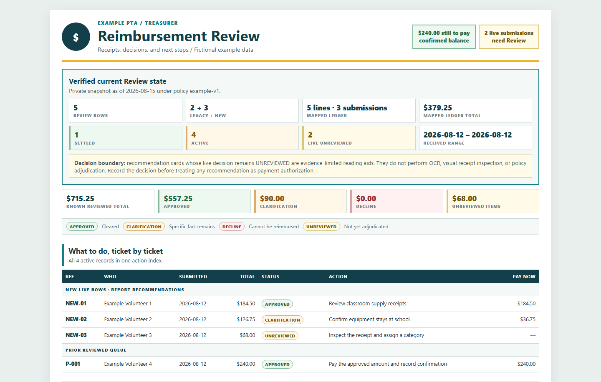
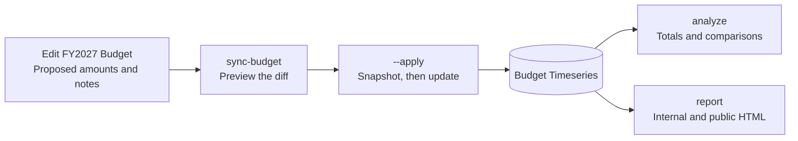
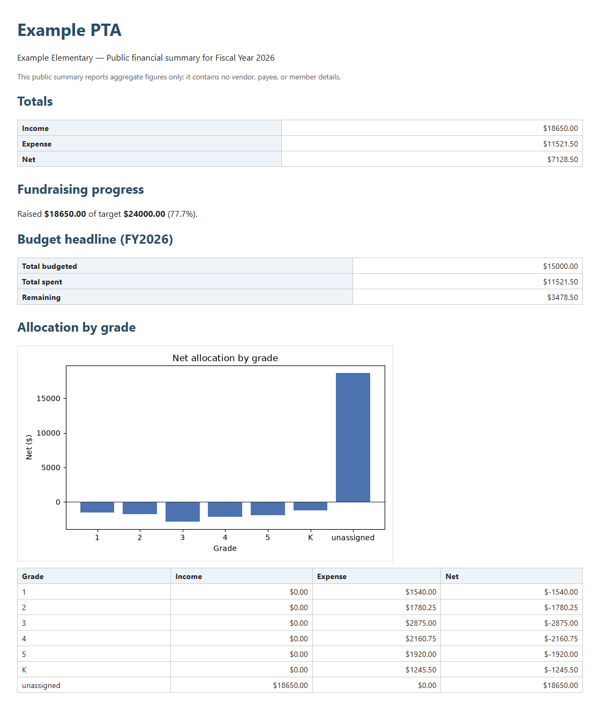
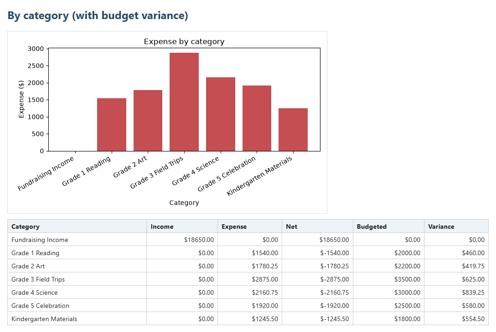
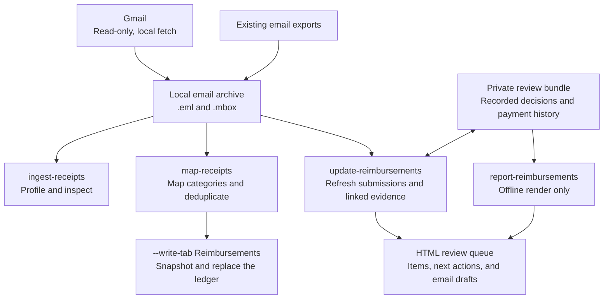
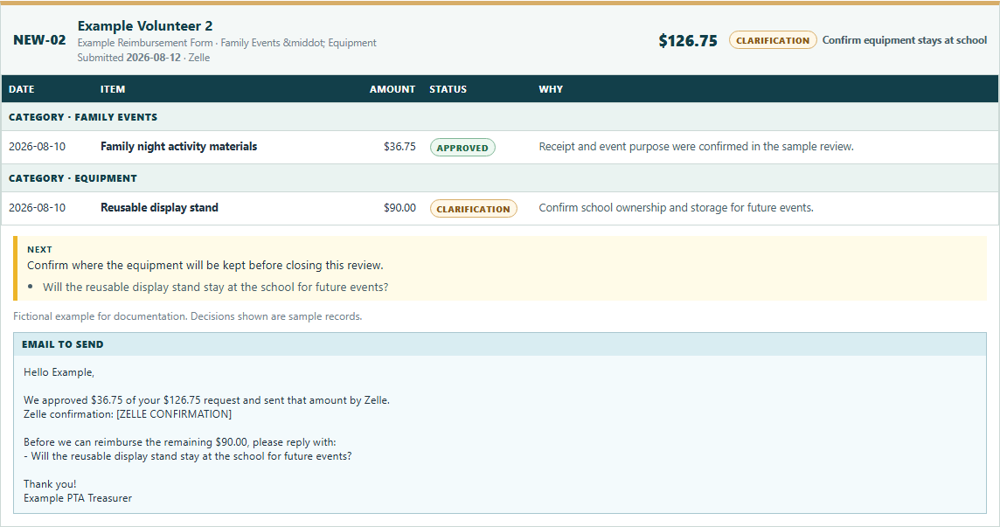

# pta_finance

[](https://github.com/aberson/pta_finance/actions/workflows/ci.yml)
[](pyproject.toml)
[](LICENSE)

A finance toolkit for PTA, booster club, and small nonprofit treasurers. Keep the budget in
**Google Sheets**, turn reimbursement emails into a **review queue**, and generate **financial
reports for the board and members**.

- **Budget in a spreadsheet.** Edit a readable annual budget, preview the changes, and sync them
  into the dataset that feeds reports and analysis.
- **Work through reimbursements.** See each request's line items, recorded decision, payment
  status, and next action, with email drafts and an archive of settled cases.
- **Prepare reports from the same numbers.** Compare spending with the budget, track fundraising
  and grade allocations, and produce internal and aggregate public summaries.

Python commands do the processing; Google Sheets and generated HTML are the operator-facing
surfaces. The HTML opens in a browser without an app server. The shipped workflows use
deterministic parsing, calculations, and templates; they do not require an LLM.



*The real reimbursement report, rendered with fictional data. All screenshots below use invented
names, amounts, and review records; no private spreadsheet or mailbox was used.*

[Workflows](#workflows) · [Getting started](#getting-started) · [Operator guides](#operator-guides) ·
[Current scope](#current-scope) · [Development](#development)

## Workflows

### 1. Edit a budget, then see what changed

The **`FY<year> Budget`** tab is where an operator edits proposed amounts and notes.
`sync-budget` previews a diff against **Budget Timeseries**, the long-format dataset used by
`analyze` and `report`. Applying the diff snapshots the affected tabs first, updates changed
amounts and notes, and appends new lines. Removed lines are flagged for review.



```powershell
uv run pta-finance sync-budget --fy 2027          # preview; no writes
uv run pta-finance sync-budget --fy 2027 --apply  # snapshot, then apply
uv run pta-finance analyze --fy 2027             # read-only analysis
```

The sync preserves actuals, other fiscal years, and enrichment columns. Editing an old copy of
a budget does not update the reporting dataset. The
[spreadsheet guide](docs/using-the-spreadsheet.md) explains which tabs to edit and how existing
spreadsheet dashboards use the data.

### 2. Prepare financial reports for two audiences

One command generates two self-contained HTML files for a fiscal year, with charts embedded in
each file. Reports cover the selected fiscal year's available data; running them monthly
refreshes that fiscal-year view.

| Output | What's included | Intended audience |
|---|---|---|
| **Internal report** | Income, expenses, net, fundraising progress, budget remaining, grade allocations, category variance, and source rows | Treasurer and board |
| **Public summary** | Headline totals, fundraising progress, budget remaining, and aggregate grade allocations | Members and the wider community |

The public report omits category detail and individual source rows. Its data model is checked
at runtime for prohibited payee, receipt, memo, and member identity fields before rendering.



*The public summary keeps the financial overview together in one browser-readable document.*

<details>
<summary><strong>Inside the internal report: category spending and budget variance</strong></summary>



The current CLI reads fiscal-year summary lines from **Budget Timeseries**. The internal
report's transaction table therefore shows those summary rows, rather than an itemized bank
ledger or the separate reimbursement queue.

</details>

```powershell
uv run pta-finance report --fy 2026 --variant both
```

This writes `reports/output/FY2026-internal.html` and `reports/output/FY2026-external.html`,
then appends a row per variant to the spreadsheet's `report_log`. Omitting `--fy` selects the
current fiscal year using the configured start month.

### 3. Turn reimbursement email into a ledger and review queue

Fetch a date window from Gmail with read-only OAuth, or use an existing `.eml` / `.mbox`
archive. The parser recognizes supported reimbursement form emails, extracts line items,
checks stated totals, and maps categories. Process the complete local archive together so
overlapping exports can be deduplicated.



The **Reimbursements** tab is a machine-owned line-item ledger; its sheet write is an explicit
step. The **private review queue** is a separate HTML report built from a validated local
bundle. Refreshing that queue preserves existing reviews and adds new submissions as
**unreviewed**, even when a card offers an item-level recommendation.



*A ticket brings the review evidence, unresolved question, and draft response into one place.
The report displays decisions and drafts; it does not submit decisions or send messages.*

Follow-up receipts and responses are linked through exact email ancestry or explicit private
anchors. Ambiguous evidence remains visible for review. Recorded payments require an explicit,
validated confirmation link or an audited operator payment record. Changed or missing evidence
for an existing review stops the refresh instead of silently carrying its decision forward.

<details>
<summary><strong>Commands for an already configured reimbursement workflow</strong></summary>

```powershell
# Acquire mail locally; never sends or modifies Gmail messages.
uv run pta-finance fetch-mail --since 2026-07-01

# Inspect the archive and mapping before any Sheet write.
uv run pta-finance ingest-receipts --source mail_samples --profile --originals-only
uv run pta-finance map-receipts --source mail_samples

# Explicitly replace the line-item ledger, with a pre-write snapshot.
uv run pta-finance map-receipts --source mail_samples --write-tab Reimbursements

# Refresh the existing private review bundle and its HTML from local mail.
uv run pta-finance update-reimbursements --dry-run
uv run pta-finance update-reimbursements

# Or just rebuild HTML from the existing bundle, completely offline.
uv run pta-finance report-reimbursements
```

The review commands require the private bundle and category mapping described in the
[receipt-loading guide](docs/loading-receipts.md#step-4--refresh-the-private-review-report).
An optional `--fetch-since` on `update-reimbursements` fetches Gmail before refreshing.
Neither review command writes Sheets or sends email. Payment itself happens outside the tool.

</details>

## Getting started

You need **Python 3.12+**, **[uv](https://docs.astral.sh/uv/)**, and a Google Sheet shared with
a Google service account. Gmail acquisition is optional and uses a separate user OAuth credential.

```powershell
git clone https://github.com/aberson/pta_finance.git
cd pta_finance
uv sync --locked --extra dev
Copy-Item config.example.toml config.toml
```

Follow **[SETUP.md](SETUP.md)** to fill in the private configuration, configure the service
account, and prepare the spreadsheet. Organization identity, contact addresses, sheet IDs,
fiscal-year start month, and grade labels are configurable.

Once the spreadsheet and credentials are ready:

```powershell
uv run pta-finance check    # validates schema/source; writes and removes a test-sheet probe
uv run pta-finance analyze
uv run pta-finance report --variant both
```

`init-sheet` provisions `report_log`; it does **not** create or populate Budget Timeseries or
the custom dashboard tabs. The canonical `transactions`, `receipts`, `budget`, and `events`
tabs belong to the optional legacy import path and are not required by current reporting.

<details>
<summary><strong>Optional: scheduled monthly reports</strong></summary>

The [monthly report workflow](.github/workflows/monthly-report.yml) runs at **09:00 UTC on the
first of each month** and supports manual dispatch. It generates both variants for the current
fiscal year, uploads them as Actions artifacts, and commits a small keepalive timestamp.
It uses `GOOGLE_SA_KEY_B64` and `PTA_CONFIG_B64` repository secrets. Gmail fetching stays local.

**Artifact access matters:** this workflow uploads the internal report too. GitHub allows
signed-in users with repository read access to
[download workflow artifacts](https://docs.github.com/en/actions/how-tos/manage-workflow-runs/download-workflow-artifacts).
In a public repository, that is not private delivery. Use a private deployment repository or
change the delivery destination before running it with confidential data. Private Drive upload
is not implemented.

</details>

## Operator guides

| What you need | Where to go |
|---|---|
| Work in the spreadsheet, change budgets, or understand its tabs | [Using the spreadsheet](docs/using-the-spreadsheet.md) |
| Get help from an AI assistant with day-to-day tasks | [Ready-to-use prompts](docs/ask-an-ai-assistant.md) |
| Connect Google credentials and prepare the Sheet | [Setup guide](SETUP.md) |
| Fetch, map, verify, and review reimbursement submissions | [Loading receipts](docs/loading-receipts.md) |
| Understand the implementation and planned work | [Project plan](plan.md) |

## Current scope

**Available now:** budget sync; fiscal-year analysis and HTML reports; local Gmail fetching;
email receipt ingestion and mapping; a private reimbursement review report with supplemental
evidence and explicit payment records; snapshots; and the monthly report workflow.

**Still in development or deferred:** an admin web app, Apps Script automation, automatic
reimbursement roll-up into Budget Timeseries, live Drive receipt retrieval/upload, and a complete
treasurer presentation workflow. The optional Windows PDF parser is only the
[treasurer-summary foundation](documentation/treasurer-summary-wave-1-plan.md), not a shipped
Google Slides command. Existing spreadsheet dashboards are workbook-specific; the CLI does
not install a dashboard suite into a fresh Sheet.

Known reimbursement refresh limitations and pending fixes are tracked in the
[reimbursement plan](documentation/reimbursement-refresh-plan.md). Automated recommendations
do not perform OCR, visual receipt inspection, or policy adjudication.

Real configuration, credentials, email archives, snapshots, and generated financial reports
belong in gitignored local paths. Only fictional examples and screenshots are committed here.

## Development

| Layer | Tools |
|---|---|
| Runtime and packaging | Python 3.12+, `uv`, Hatchling |
| Google access | `gspread`, `google-auth`; optional Gmail user OAuth via Google's API client |
| Analysis and reports | pandas, matplotlib, Jinja2 |
| Optional foundations | WeasyPrint PDF renderer; `pypdfium2` in a Windows-isolated worker |
| Quality checks | pytest, Ruff, strict mypy; Linux and Windows GitHub Actions jobs |

```text
pta_finance/
  cli.py, config.py              Commands and private configuration
  budget_sync.py, report_source.py
                                 Editable budgets and Budget Timeseries adapter
  receipt_ingest.py, receipt_map.py, gmail_source.py
                                 Email acquisition, parsing, and ledger mapping
  reimbursement_*.py             Review evidence, refresh, and HTML report
  analytics/, reports/           Aggregations, charts, and report templates
  treasurer_slides/              Native PDF parser foundation
tests/                           Fictional fixtures and automated checks
docs/                            Operator guides and README screenshots
documentation/                   Feature plans and implementation records
```

<details>
<summary><strong>Run the quality checks</strong></summary>

```powershell
uv sync --locked --extra dev --extra slides
uv run ruff check .
uv run ruff format --check .
uv run mypy --strict pta_finance
uv run pytest -q
uv run python scripts/check_no_identity.py
```

The native PDF parser tests require Windows and the `slides` extra. For the Linux test split,
see [CI](.github/workflows/ci.yml). The ordinary report workflow does not require that extra.

</details>

<details>
<summary><strong>Regenerate the README screenshots</strong></summary>

```powershell
uv run --with playwright==1.58.0 python -m playwright install chromium
uv run --with playwright==1.58.0 python scripts/capture_readme.py
```

The [capture script](scripts/capture_readme.py) builds invented Budget Timeseries rows and a
fictional review bundle, renders the production templates, and captures them in headless
Chromium. It reads only `config.example.toml`, makes no Google calls, and leaves only the four
PNGs under `docs/screenshots/`. Browser downloads are needed on first use; Playwright is not
a runtime dependency of the toolkit.

</details>

## License

[MIT](LICENSE).
