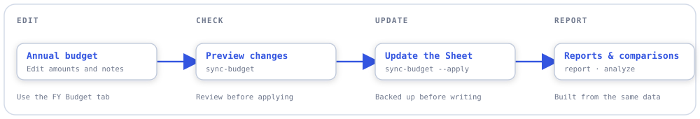
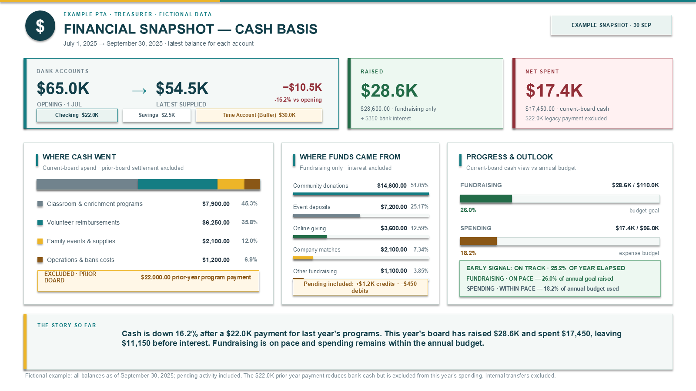
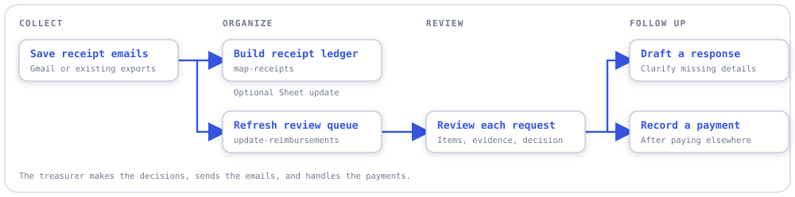

# pta_finance

[](https://github.com/aberson/pta_finance/actions/workflows/ci.yml)
[](pyproject.toml)
[](LICENSE)

Keep PTA finances in order: **plan a budget, review reimbursements, and explain the numbers to
your board.** Also suited to booster clubs and small nonprofits.

- **Plan the budget.** Edit amounts in Google Sheets and check changes before saving.
- **Review reimbursements.** See each request, its status, and what needs to happen next.
- **Explain the numbers.** Track fundraising, spending, and progress against the budget.

Google Sheets holds the budget. A local Python tool prepares the reports, which open in your
browser.


*The real review report with fictional names, amounts, and decisions. All examples on this page
use fictional data.*

[Workflows](#workflows) · [Get started](#get-started) · [Guides](#guides) · [Project status](#project-status)

## Workflows

### Update the budget

Edit the **`FY<year> Budget`** tab in Google Sheets. Preview your changes, then apply them.
The tool saves a backup first and leaves actual spending and other years alone.

<picture>
  <source media="(prefers-color-scheme: dark)" srcset="docs/diagrams/budget-workflow-dark.svg">
  
</picture>

Reports read **Budget Timeseries**, the sheet's table of budget and actual amounts.
The [spreadsheet guide](docs/using-the-spreadsheet.md) explains which tabs to edit.

<details>
<summary><strong>Budget and report commands</strong></summary>

```powershell
uv run pta-finance sync-budget --fy 2027          # preview changes
uv run pta-finance sync-budget --fy 2027 --apply  # back up, then save
uv run pta-finance analyze --fy 2027             # show totals and comparisons
uv run pta-finance report --fy 2027 --variant both
```

The last command saves two HTML reports in `reports/output/` and records the run in the
sheet's `report_log`:

- **Internal:** totals, grade allocations, category comparisons, and source rows for the board.
- **Public:** summary figures, with payee, receipt, and individual source details omitted.

Reports cover the selected fiscal year's available data. Leave out `--fy` on `report` to use
the current fiscal year. The source rows are annual summaries, not an itemized bank ledger.

</details>

### Tell the financial story

A single slide brings together cash on hand, money raised, spending, and progress toward the
annual goals. The short summary explains why the balance changed.



*Fictional copy of the approved treasurer snapshot prototype.
[Download the editable PowerPoint](docs/examples/treasurer-snapshot.pptx).
Automatic slide creation is still in development.*

### Work through reimbursements

Fetch receipt emails from Gmail, or use an existing email export. The tool sorts line items,
checks totals, and prepares the review queue.

<picture>
  <source media="(prefers-color-scheme: dark)" srcset="docs/diagrams/reimbursement-workflow-dark.svg">
  
</picture>

Each request shows its items, decision, payment status, and next step. New requests stay
**unreviewed** until a decision is recorded. Suggestions help with review; they do not authorize
payment. The treasurer sends replies and handles payments.


*The items, open question, and draft reply stay together.*

Follow-up receipts and replies can be linked to the original request. Unclear matches remain
visible for review. If evidence behind an existing review changes or disappears, the refresh
stops so it can be checked.

<details>
<summary><strong>Receipt and review commands</strong></summary>

These commands assume the setup in the [receipt guide](docs/loading-receipts.md) is complete,
including a category map and private review data file.

```powershell
# Download emails. Gmail access is read-only.
uv run pta-finance fetch-mail --since 2026-07-01

# Check the complete local archive before updating the Sheet.
uv run pta-finance ingest-receipts --source mail_samples --profile --originals-only
uv run pta-finance map-receipts --source mail_samples

# Optional: back up and replace the Reimbursements tab.
uv run pta-finance map-receipts --source mail_samples --write-tab Reimbursements

# Preview a review-queue refresh, then run it.
uv run pta-finance update-reimbursements --dry-run
uv run pta-finance update-reimbursements

# Rebuild the HTML from saved review data, without checking email.
uv run pta-finance report-reimbursements
```

The Sheet ledger and private review report are separate. Refreshing the report does not update
Sheets or send email. Add `--fetch-since` to `update-reimbursements` to fetch mail first.

</details>

## Get started

Day-to-day budget editing happens in Google Sheets. Initial setup and report updates need
**Python 3.12+**, **[uv](https://docs.astral.sh/uv/)**, and Google credentials.

```powershell
git clone https://github.com/aberson/pta_finance.git
cd pta_finance
uv sync --locked --extra dev
Copy-Item config.example.toml config.toml
```

Follow **[SETUP.md](SETUP.md)** to connect your Sheet and fill in the private configuration.
Your organization name, contacts, fiscal year, and grade labels are configurable.
Gmail access is optional.

The toolkit expects a prepared spreadsheet. It does not build the budget tables or install
dashboards into a blank Sheet.

<details>
<summary><strong>Optional: monthly reports</strong></summary>

The [monthly workflow](.github/workflows/monthly-report.yml) refreshes both HTML reports on the
first of each month at 09:00 UTC. It can also be run manually. Setup uses the repository secrets
`GOOGLE_SA_KEY_B64` and `PTA_CONFIG_B64`. Mail fetching stays on your computer.

The workflow uploads **both reports**, including the internal version, as downloadable GitHub
files. Anyone signed in with repository read access can
[download them](https://docs.github.com/en/actions/how-tos/manage-workflow-runs/download-workflow-artifacts).
For confidential data, use a private repository or change where the reports are delivered.
Private Drive upload is not built yet.

</details>

## Guides

| I want to… | Read |
|---|---|
| Edit the budget or understand the spreadsheet | [Spreadsheet guide](docs/using-the-spreadsheet.md) |
| Connect Google and run the tool | [Setup guide](SETUP.md) |
| Load receipts and refresh the review queue | [Receipt guide](docs/loading-receipts.md) |
| Ask an AI assistant for help | [Example prompts](docs/ask-an-ai-assistant.md) |

## Project status

**Ready to use:** budget updates, financial analysis, HTML reports, Gmail downloads, receipt
mapping, and the reimbursement review queue.

**In progress:** turning the treasurer snapshot prototype into an automatic slide workflow.
The [slide plan](documentation/treasurer-summary-wave-1-plan.md) tracks the remaining work.

**Optional collaboration proof:** the `web` extra adds an authenticated service for one
fictional request, shared comments, and a reviewer-to-processor handoff. The reviewer approves
or does not approve; only the processor can complete an approved handoff. Completion does
not record a payment. Local checks use signed identities, real HTTP, Chromium, and Firestore
emulator transactions. Real two-account comments acceptance (M6) passed; hosted handoff
acceptance (M7) is next. See the [shared-workflow runbook](docs/shared-workflow-proof.md)
for startup, packaging, and both cloud acceptance procedures.

**Not built yet:** an admin web app, automatic reimbursement totals in the budget, or live
Drive receipt retrieval and report upload. Existing spreadsheet dashboards are specific to the
workbook. See the [project plan](plan.md) and
[known review limitations](documentation/reimbursement-refresh-plan.md) for details.

Real configuration, credentials, emails, and financial reports stay in private local files
excluded from Git. The tool does not require an AI model.

<details>
<summary><strong>For developers</strong></summary>

Python, pandas, and matplotlib handle the numbers and charts. Jinja2 renders the reports.
Google access uses `gspread` and Google's API client.

```powershell
uv sync --locked --extra dev --extra slides --extra web
uv run ruff check .
uv run ruff format --check .
uv run mypy --strict pta_finance
uv run pytest -q
uv run python scripts/check_no_identity.py
```

Native PDF parser tests need Windows and the `slides` extra.
Full-package mypy and the complete web-enabled suite require `web`; start the loopback
Firestore emulator and install Chromium as described in the shared-workflow runbook first.
The base installation can still run its existing regression suite without `web`.
See [CI](.github/workflows/ci.yml) for the Linux test split.

</details>

<details>
<summary><strong>Update the README visuals</strong></summary>

Capture the two reimbursement screenshots with fictional data:

```powershell
uv run --with playwright==1.58.0 python -m playwright install chromium
uv run --with playwright==1.58.0 python scripts/capture_readme.py
```

The [capture script](scripts/capture_readme.py) renders the real report template without reading
private data or connecting to Google.

The [snapshot source](docs/examples/treasurer-snapshot.pptx) is an editable, fictional slide.
After editing it, export its screenshot with desktop PowerPoint on Windows:

```powershell
powershell -NoProfile -File scripts/export_example_snapshot.ps1
```

Workflow diagrams are editable SVGs in [docs/diagrams](docs/diagrams/), with light and dark
versions in the style of [skill-mesh](https://github.com/aberson/skill-mesh).

</details>

## License

[MIT](LICENSE).
